
<h1 align="center">基于的图书进销存管理系统</h1>

## 简介
图书进销存管理系统：角色分为用户和管理员；提供用户管理、图书类型管理、进货订单管理、商品退货管理、库存分析、客户与供应商管理等功能，支持图书信息录入与查询。    --计算机毕业设计源码；毕设源码；java毕业设计源码

## 联系方式

<h3 align="center">获取完整代码与数据库文件 + 微信：deepguan QQ: 86050149 QQ群: 783742310</h3>

<h3 align="center">可帮忙远程部署 包运行成功！提供远程部署、修改代码、设计文档指导、代码讲解等服务！</h3>

## 功能介绍（完整见运行截图）
管理员：拥有全面的系统管理权限，可以访问和操控用户管理、图书类型管理、订单管理、商品退货管理、库存分析管理等模块。可以新增、修改、审核和删除用户信息，进行图书分类设置，管理进货和批销订单，并分析库存和财务数据。管理员还可以通过个人中心更新个人信息，并利用轮播图管理功能更新系统宣传图像。

用户：能够通过注册和登录功能进入系统，并在个人中心查看和调整自己的信息。用户可以访问首页的主要导航菜单，浏览和搜索图书，通过进货订单和商品退货管理模块进行操作。用户还可以使用图书信息管理、客户信息管理和库存分析管理模块，录入和管理相关数据，提交、查询或取消订单信息，并根据需要与供应商和客户进行沟通和管理。

## 运行截图
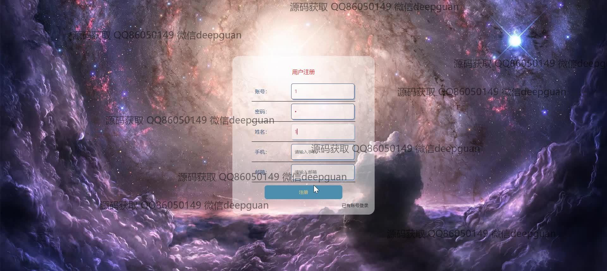
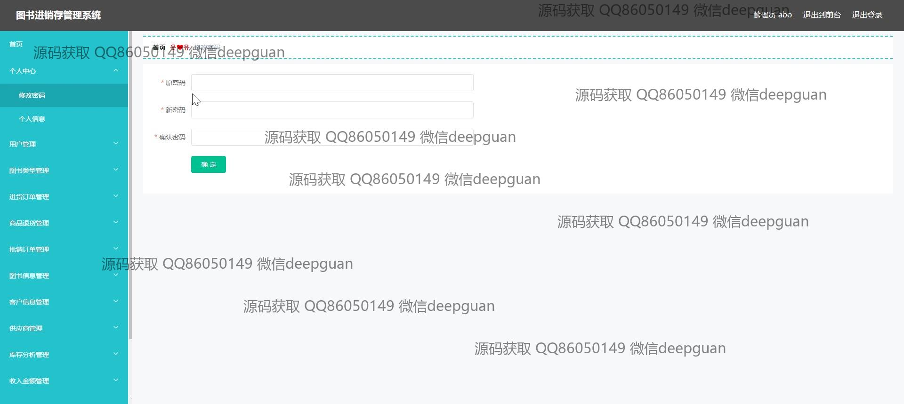
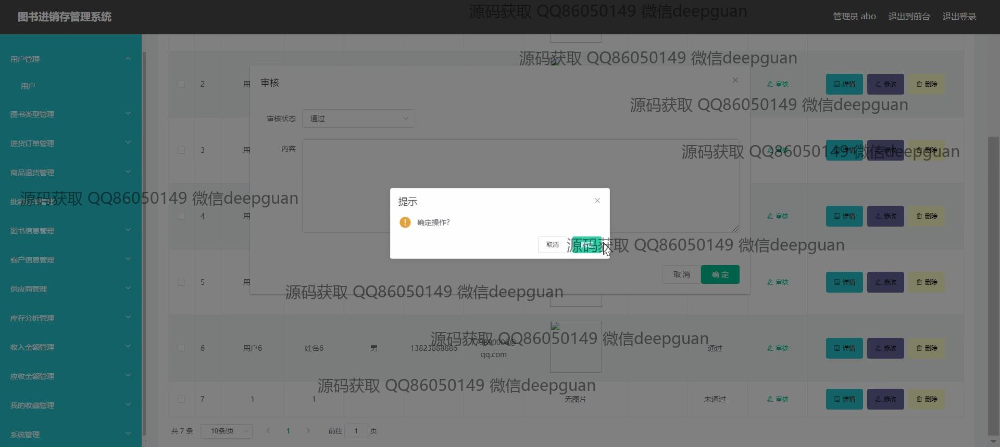
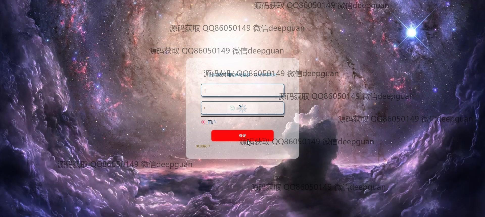
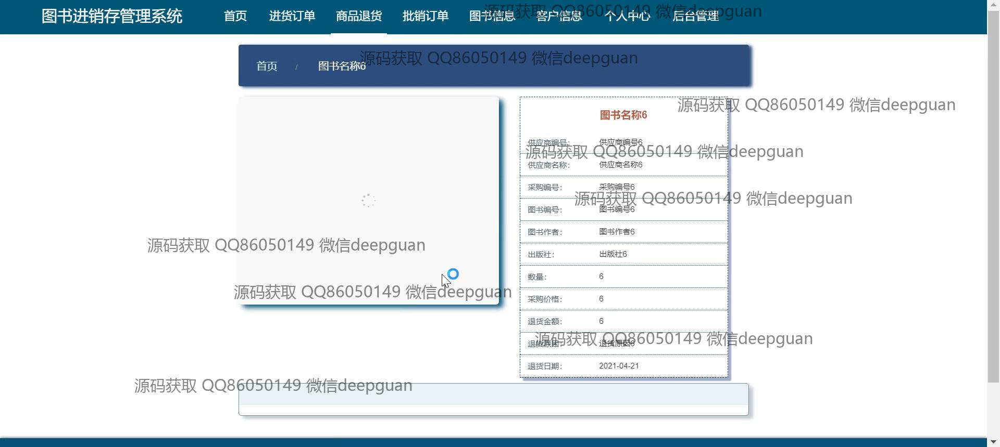
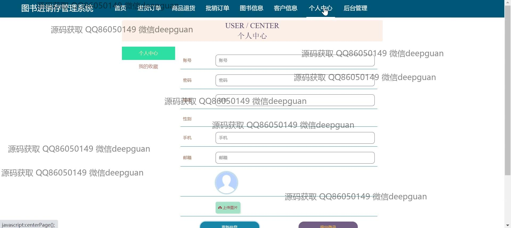
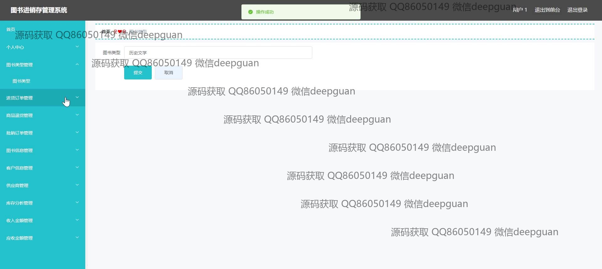
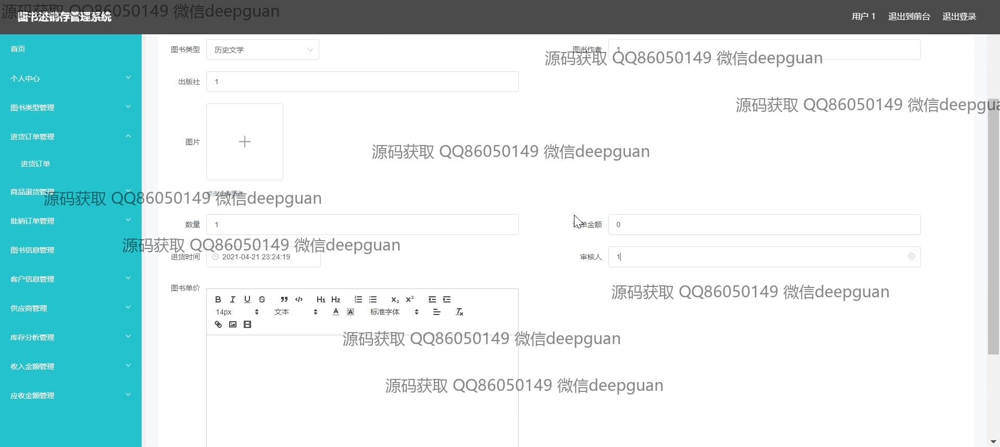
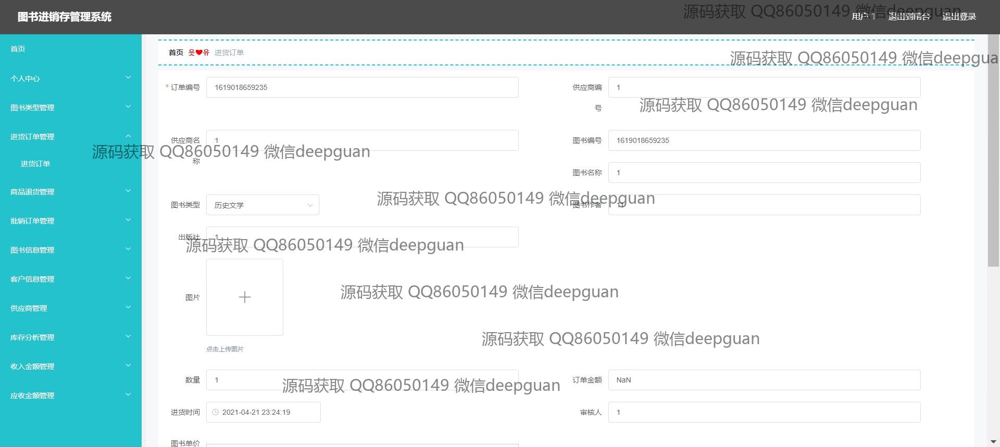
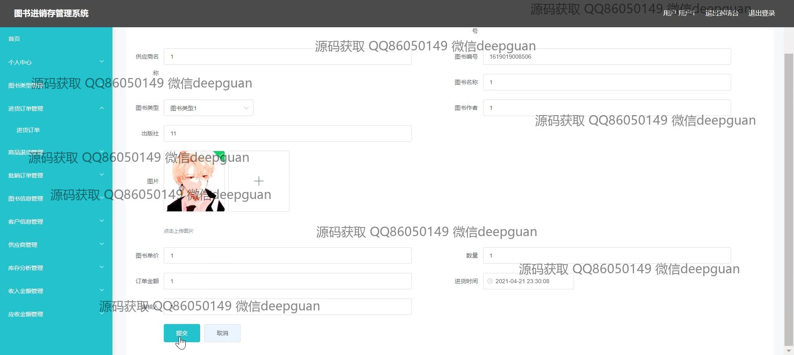
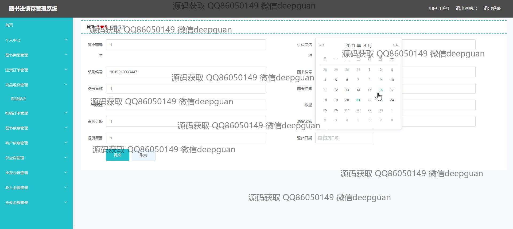
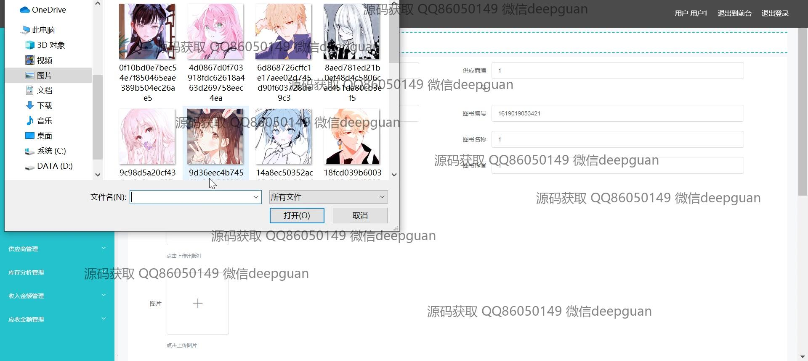
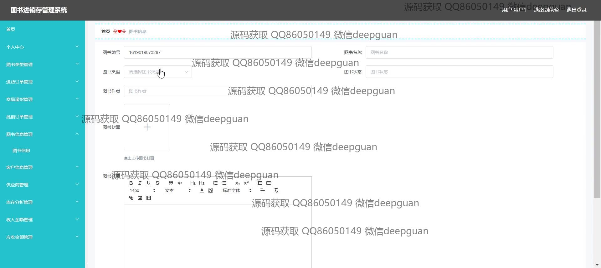
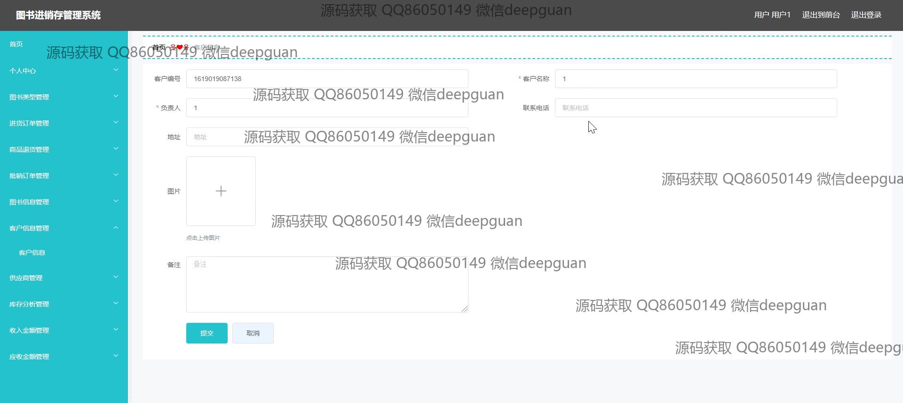
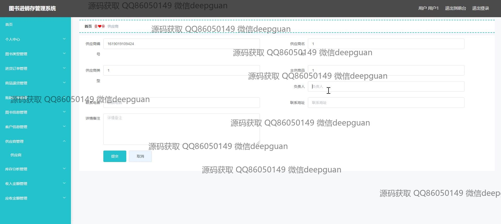
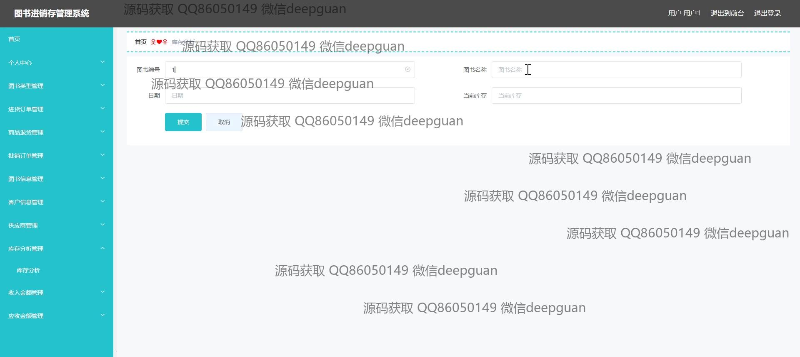
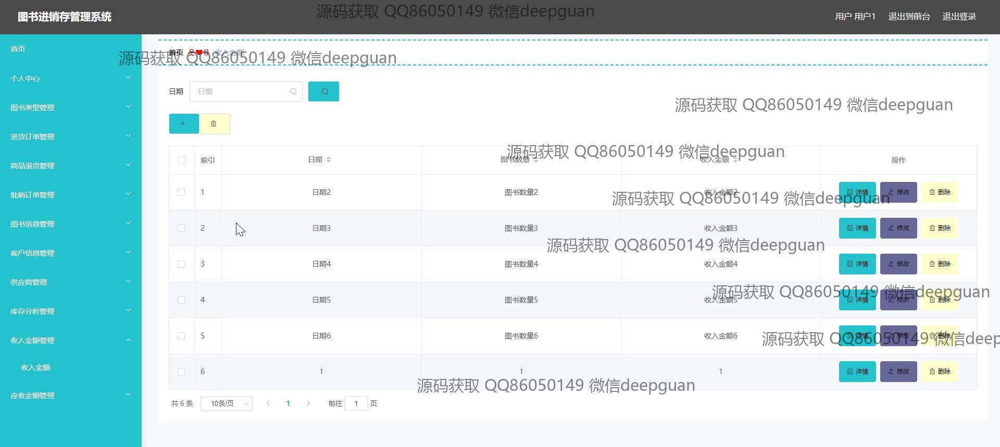
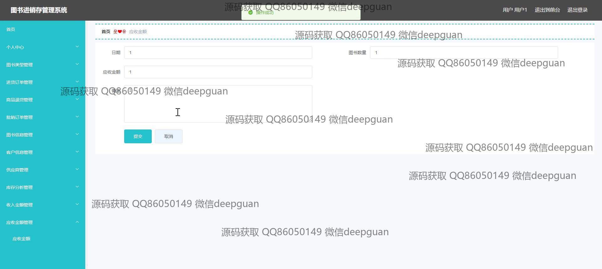

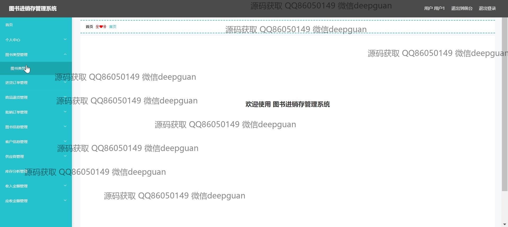

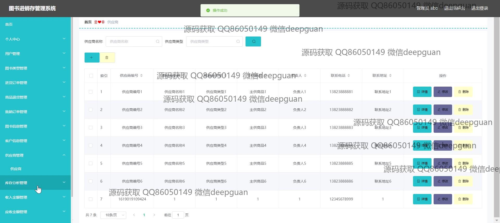
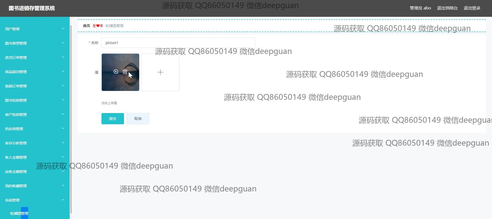

本代码来源于网络,仅供学习参考使用!

